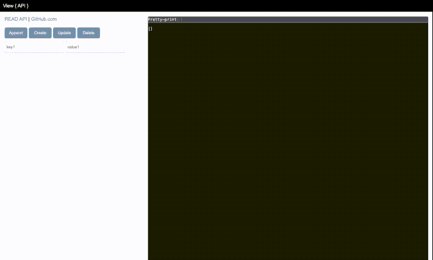

# [api.com](https://github.com/SaintClever/SBA-318-Express-Server-Application)

***API and JSON - Viewer***

- Create a dummy API or JSON data and view it before using

Start:
- npm init
- node --watch app.js or npm start

<!--  -->